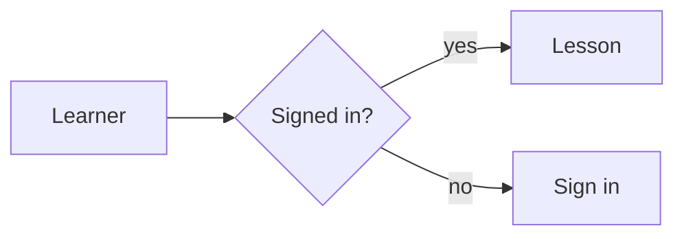

# Writing courses

Everything a course author controls lives under `content/courses/`. No code changes are needed.

```text
content/courses/<course>/
  course.md          settings (front matter) + "About this course" (body)
  en/<lesson>.md     one file per lesson, English (required)
  hi/<lesson>.md     translation (optional — missing lessons fall back to English)
```

## `course.md`

```markdown
---
title: Money Confidence
icon: ₹
category: money     # the subject this course is filed under (see src/data/categories.ts)
summary: One or two sentences shown on cards and the landing page.
outcome: "I can make a basic money plan…"     # optional "what you will be able to say"
level: Beginner
status: published        # draft = hidden from catalog and 404 in production
featured: true           # shown first on the home page
order: 10                # lower first
accent: "#087f6b"        # optional cover colour
tags: [money, beginner]
prerequisites: [A bank account]
price: { inr: 499, usd: 9 }   # major units. Omit entirely for a FREE course.
i18n:
  hi: { title: …, summary: …, outcome: … }    # optional overrides per language
modules:
  - title: Basics
    lessons: [understand-your-money, simple-budget]   # lesson file names, no .md
---

Markdown body: the **About this course** section. Headings, lists, links, images.
```

**Pricing and access.** `price.inr` is sold through Razorpay, `price.usd` through Stripe; set one or both.
Free courses can be read by anyone; signing in and enrolling (one click) saves progress. Paid courses
require a signed-in Google account and unlock after a verified payment.

## Lesson files

```markdown
---
title: Make a simple budget
summary: One line shown in the outline.      # optional
minutes: 6                                   # optional reading time
objectives:                                  # optional "In this lesson" box
  - Give every rupee a job
preview: false           # true = readable without buying (still needs sign-in)
draft: false             # true = hidden from the outline in production
---

Body is Markdown. Do not repeat the title as a `#` heading — it is added for you.
```

Supported Markdown: everything standard (GFM tables, task lists), the `!!! warning "Title"` callouts used
by existing lessons, and relative links to other lessons (`[next](./other.md)` resolves within the course).

## Quizzes

Put a fenced block tagged `quiz` anywhere in a lesson. The content is YAML. Quizzes are graded in the
browser, show the `explain` text, and record the attempt for signed-in learners.

| `type` | Fields | `answer` |
| --- | --- | --- |
| `single` | `question`, `options` | option number, **starting at 1** |
| `multiple` | `question`, `options` | list of option numbers, e.g. `[1, 3]` |
| `truefalse` | `question` | `true` or `false` |
| `fill` | `question` | accepted text, or a list of accepted texts (case/space-insensitive) |
| `order` | `question`, `options` | *(none)* — list `options` in the **correct** order; learners see them shuffled |

All types accept `explain:` (shown after answering). Mistakes in a quiz fail the build with the file name
and quiz number. See `sample-paid-course/en/quiz-types.md` for one of each.

## Code blocks

Fence code with a language name and it is syntax-highlighted ([Shiki](https://shiki.style/languages) — nearly
every language is supported: `python`, `js`, `ts`, `bash`, `sql`, `go`, `java`, `rust`, `html`, `yaml`, …).
Every block gets a language label and a **Copy** button.

````markdown
```python
print("Hello")
```

```js title="app.js"          ← adds a file-name caption
console.log("Hello");
```

```python tab="Python"        ← consecutive blocks with tab="…" become one tabbed group
print("Hello")
```
```js tab="JavaScript"
console.log("Hello");
```
````

Use `text` for output or anything that should not be highlighted. See `sample-paid-course/en/code-blocks.md`.

Courses uploaded as a zip colour these languages: bash, c, c++, c#, css, diff, dockerfile, go, html, java,
javascript, json, jsx, kotlin, markdown, php, python, ruby, rust, sql, tsx, typescript, yaml (plus short names
such as `js`, `ts`, `py`, `sh`). Any other language still shows, without colours.

## Diagrams (Mermaid)

Fence a diagram with `mermaid`. It works in course lessons, uploaded zips and library pages.

````markdown

````

Every [Mermaid diagram type](https://mermaid.js.org/intro/) works (flowchart, sequence, class, state, ER, Gantt, mind map…).
Diagrams are drawn in the browser, follow the light/dark theme, and are only downloaded on pages that have one. If a
diagram has a syntax mistake, its text is shown with a red outline instead. See `sample-paid-course/en/diagrams.md`.


## Animated flow diagrams (flowmap)

Fence a flow diagram with `flow`. Traffic moves along links, and you mark the single points of failure and
chokepoints yourself (nothing is guessed).

````markdown
```flow
node customer "Customer" client
node api "API" service replicas=3
node db "Orders DB" database
customer -> api <-> db "SQL"
flow order "Place an order" rate=40: customer -> api <-> db
spof db "One copy of the data"
```
````

Blocks have kinds (`client`, `service`, `gateway`, `cache`, `database`, `document`, `storage`, `disk`, `queue`,
`stream` (or `kafka`), `worker`, `external`, `ingress`, `egress`, `proxy`), links can be two-way (`<->`), groups draw VPCs and clusters, zones power a what-if button, and
`via=` / `sidecar=` show proxy layers. The full language is in `packages/flowmap/README.md`, and the tutorial course
`create-a-course` teaches it step by step with live examples. A mistake in a diagram fails the build (or the upload check)
with the file, the diagram number and the line.


## Mathematical formulas

Write formulas in LaTeX notation, drawn by [KaTeX](https://katex.org/) when the page is built (or the zip is uploaded),
so readers download no maths code and screen readers get a spoken version.

````markdown
Inline: $E = mc^2$.

$$
x = \frac{-b \pm \sqrt{b^2 - 4ac}}{2a}
$$
````

Put `$$` on its own lines for a display formula. Write dollar amounts as `\$5`. A formula KaTeX cannot read fails the
upload check and the build, with the file and line. Formulas inside code blocks or `backticks` are plain text.


## Images, info blocks and collapsible blocks

No HTML is needed (and uploaded courses drop it). Everything below works in git courses, uploaded zips and library pages.

````markdown


::figure[Caption]{src="../images/phone.png" alt="Description" align=right width=40%}

:::gallery


:::

:::tip[Optional title]
Markdown works inside. Types: note, info, tip, success, warning, danger.
:::

:::details[Show the answer]{open}
Hidden until opened. Add {open} to start expanded.
:::
````

- **Alt text is required** on every image (the upload check refuses images without it).
- `align` is `left`, `right` (text wraps around), `center` or `full`; `width` is `10%`..`100%` or like `320px`. On a phone,
  pictures always sit above the text at full width.
- In a zip, keep pictures in `images/` and write `../images/name.png`. In a course kept in git, put pictures in `public/images/`
  and write `/images/name.png`.
- The older `!!! warning "Title"` callout still works. See the tutorial lesson "Images, info blocks and collapsible blocks".
