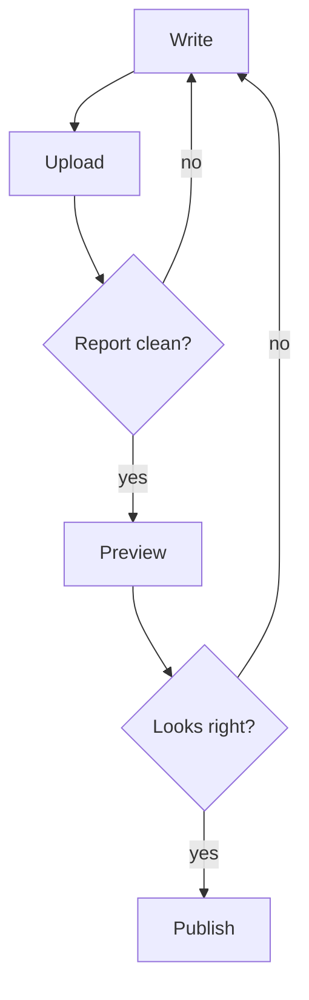

Go through this list before you press **Publish**.

## The course

- The title, summary and outcome sentence say what a learner gets.
- The category and level are right, and the price is what you intend (no `price` means free).
- `status` is `published`, not `draft`.

## Every lesson

- The title is in the settings, and there is no `# Heading` in the body.
- One idea per lesson, three to six minutes.
- A quick check at the end.
- Diagrams have a short sentence around them saying what to notice.

## Before and after upload

- The upload report has no errors, and you have read the warnings.
- You previewed it, clicked through every lesson, and tried every quiz and diagram.
- Lesson names match the previous version, so learners keep their progress.



```quiz
type: multiple
question: Which of these should you do before publishing?
options:
  - Read the upload report
  - Preview the draft as a learner
  - Rename every lesson
  - Try each quiz
answer: [1, 2, 4]
explain: Keep lesson names stable, since progress is saved by name.
```
