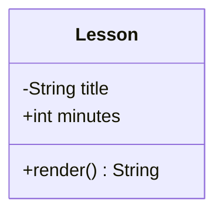
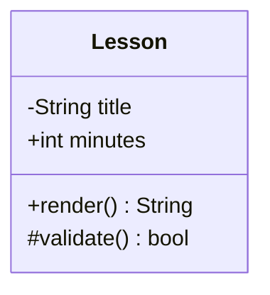
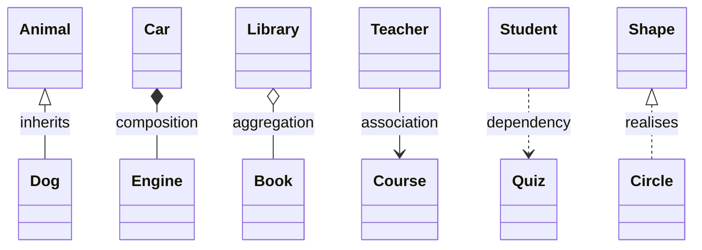
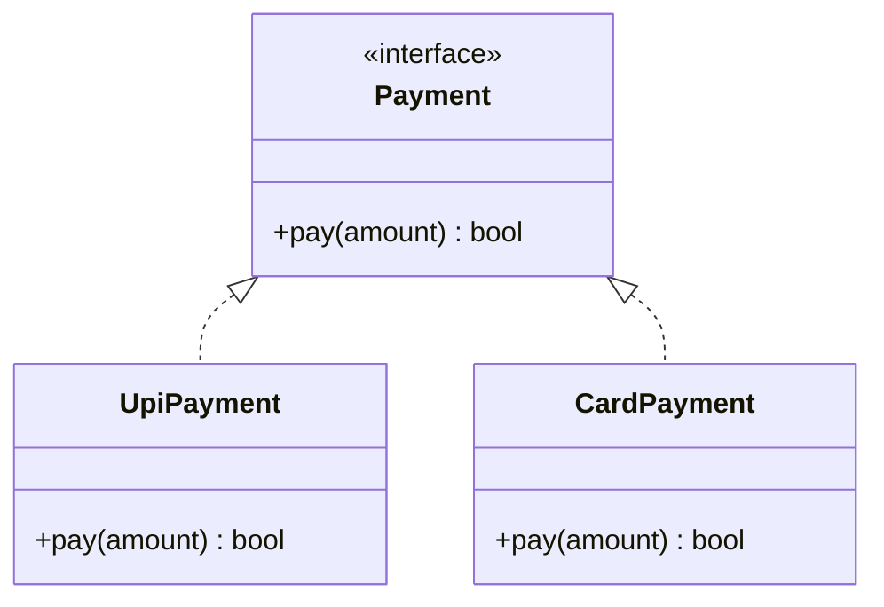
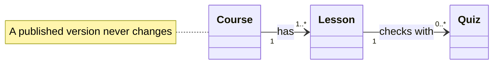
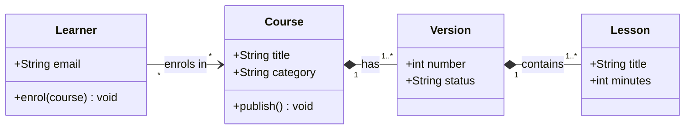

A **class diagram** shows the parts of a system and how they relate. It is not only for programmers: it works for
anything that has types of things with properties, such as courses, lessons and quizzes.

````markdown

````



Inside the braces, one line per member. A line with brackets is a method; a line without is a field. The sign in
front says who can see it:

| Sign | Means |
| --- | --- |
| `+` | Public |
| `-` | Private |
| `#` | Protected |
| `~` | Package or internal |

## Relationships

The arrow shape carries the meaning:



| Arrow | Reads as |
| --- | --- |
| `<\|--` | "is a kind of" (inheritance) |
| `*--` | "is made of, and cannot exist without" (composition) |
| `o--` | "has, but the parts can exist alone" (aggregation) |
| `-->` | "uses or knows about" (association) |
| `..>` | "depends on" |
| `<\|..` | "implements" (realisation) |

## Interfaces and labels

Mark a class with an annotation such as `<<interface>>`. Text after a colon labels the arrow.



## How many?

Put numbers in quotes at either end of a relationship: `"1"`, `"0..1"`, `"1..*"`, `"*"`.



`direction LR` lays the diagram out left to right, which suits wide diagrams. Use `note for ClassName "text"` for a
note attached to a class.

## A complete small example



## Habits that make them clear

- Show what matters, not every field. Four or five members per class is plenty.
- Name relationships with a short label.
- Draw at most about eight classes in one diagram.
- To show how a *process* flows, use a sequence diagram or a flow diagram instead.

```quiz
type: single
question: Which arrow means one class is a kind of another (inheritance)?
options:
  - o--
  - <|--
  - ..>
answer: 2
explain: The hollow triangle points at the parent class.
```

```quiz
type: multiple
question: Which of these can you write inside a class box?
options:
  - A field such as +int minutes
  - A method such as +render() String
  - An annotation such as <<interface>>
  - A flow of traffic with replicas
answer: [1, 2, 3]
explain: Traffic and replicas belong in a flow diagram, not a class diagram.
```
