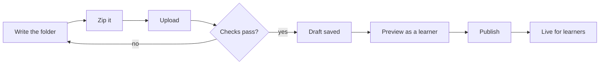

A Learnatu course is a folder of plain text files. You write them in any text editor. There is no special
software to learn.

## The folder

````text
money-basics/
  course.md              the course: title, summary, price, and the order of lessons
  en/
    understand-money.md  one file per lesson, in English (required)
    make-a-budget.md
  hi/
    understand-money.md  a Hindi version of a lesson (optional)
  images/
    budget-sheet.png     pictures used in lessons (optional)
````

- **`course.md`** holds the settings and the "About this course" text.
- **`en/`** has one Markdown file per lesson. Every lesson in the course must exist here.
- **`hi/`** is optional. A lesson with no Hindi file shows the English one to Hindi readers.
- **`images/`** is optional.

## Two ways to add a course

1. **Upload a zip.** Zip the folder, open the author page, and upload it. This is the way to use if you do not
   work with the website's code.
2. **Put the folder in git.** Add it under `content/courses/` and deploy. This is for developers.

Both are checked by the same rules and look identical to learners. This course uses the zip route in its last lessons.

## From idea to published



Nothing is visible to learners until you publish. Every upload becomes a numbered **version**, and you can go back
to an older one at any time.

```quiz
type: single
question: Which lessons must exist in the en/ folder?
options:
  - Only the first lesson
  - Every lesson listed in course.md
  - None, en/ is optional
answer: 2
explain: course.md lists the lessons. Each listed lesson needs an English file. Other languages are optional.
```
