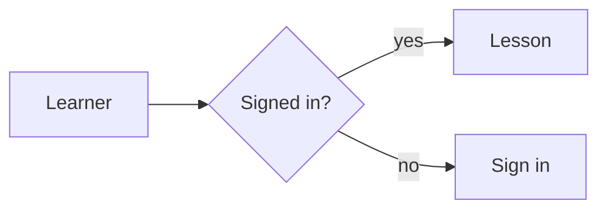
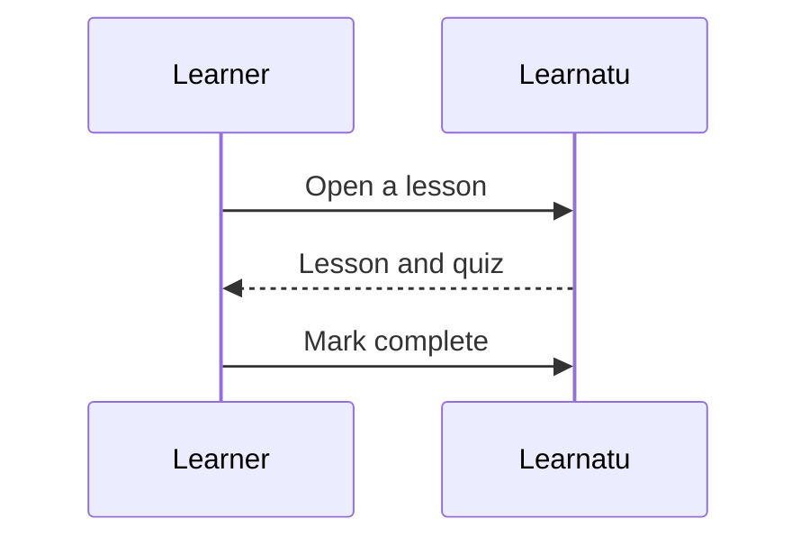
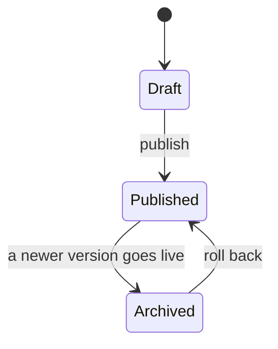

[Mermaid](https://mermaid.js.org/intro/) draws diagrams from text. Fence the text with the word `mermaid`.

````markdown

````

It becomes:


## Other kinds

A **sequence diagram** shows who talks to whom, in order:



A **state diagram** shows the steps something moves through:



Mermaid also does class diagrams, entity-relationship diagrams, Gantt charts, mind maps and more. The
[Mermaid documentation](https://mermaid.js.org/intro/) shows each one.

## Good to know

- Diagrams follow the site theme, so they work in light and dark.
- The diagram text stays on the page, so it is readable even if drawing fails.
- If a diagram has a mistake, its text is shown with a red outline. Open the lesson and check the syntax.
- For moving traffic, bottlenecks and failure points, use the **flow diagrams** in the next lesson.

```quiz
type: single
question: What goes after the three backticks to make a Mermaid diagram?
options:
  - diagram
  - mermaid
  - chart
answer: 2
```
