[Mermaid](https://mermaid.js.org/intro/) draws diagrams from text. Fence the text with the word `mermaid`. The first
line of the block says which kind of diagram it is.

````markdown
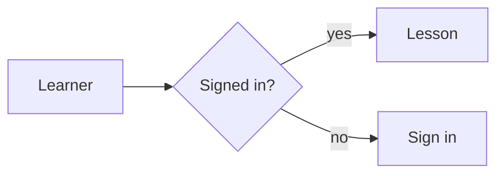
````


## How it works on Learnatu

- The text stays on the page. Your browser draws the picture from it, so it is readable even if drawing fails.
- The colours come from the site's theme. The same diagram looks right in the original, white and dark themes, and
  is redrawn when a reader switches.
- The Mermaid library is only downloaded on pages that have a diagram.
- A diagram that is too wide for the page scrolls sideways instead of shrinking.

## Which diagram do I need?

| You want to show | Use | First line |
| --- | --- | --- |
| Steps and decisions | Flowchart | `flowchart TD` or `flowchart LR` |
| Who talks to whom, in order | Sequence diagram | `sequenceDiagram` |
| The states something moves through | State diagram | `stateDiagram-v2` |
| How things are structured | Class diagram | `classDiagram` |
| How data tables relate | Entity-relationship diagram | `erDiagram` |
| A schedule | Gantt chart | `gantt` |
| Parts of a whole | Pie chart | `pie` |
| Ideas branching from one topic | Mind map | `mindmap` |
| Events over time | Timeline | `timeline` |

For moving traffic, bottlenecks and failure points in a system, use the **flow diagrams** in the next lesson instead.

## Flowcharts in detail

`TD` means top to down and `LR` means left to right (`RL` and `BT` also work). Each block has an id (`A`) and
optional text. The brackets around the text choose the shape:

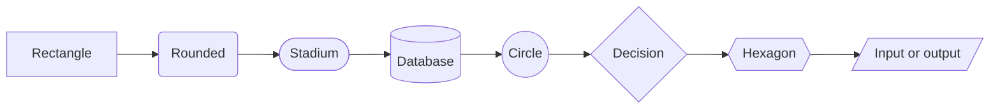

Links come in several styles, and text on a link goes between dashes:

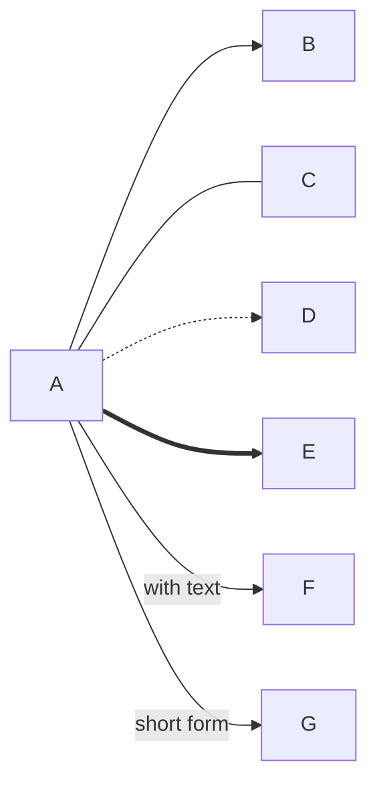

Use a **subgraph** to group blocks in a titled box:

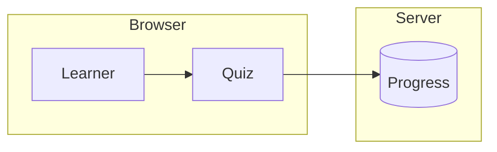

Give a block a class to colour it. Use colour sparingly, and never as the only way to tell things apart, because
some readers cannot see it:

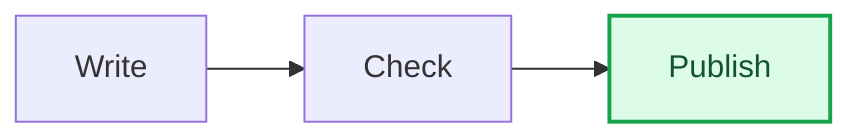

## Sequence diagrams

The [next lesson](/courses/create-a-course/sequence-diagrams/) covers these in full. In short, arrows show messages between participants, in time order. `->>` is a request, `-->>` a reply. Add `loop`, `alt`
(with `else`), notes and `autonumber`:

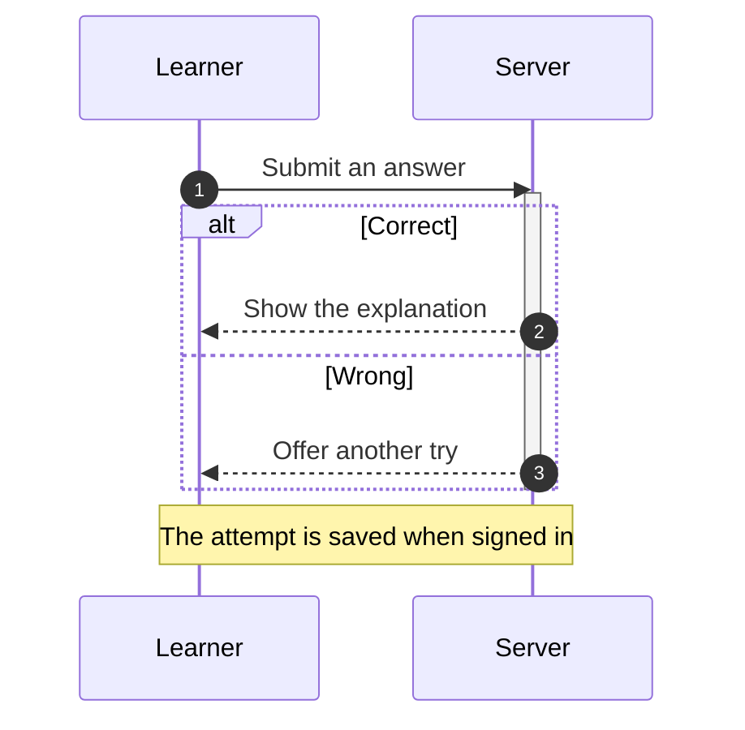

## State diagrams

Good for anything with a lifecycle, such as a course version:

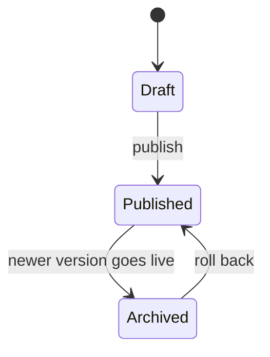

## Class and entity-relationship diagrams

Class diagrams have [their own lesson](/courses/create-a-course/class-diagrams/). In short, a **class diagram** lists the parts of a thing and how they connect:

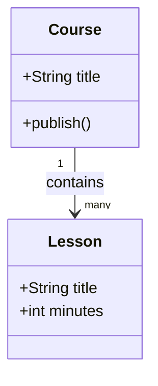

An **entity-relationship diagram** is the usual way to draw database tables. The symbols at each end mean "one" or
"many":

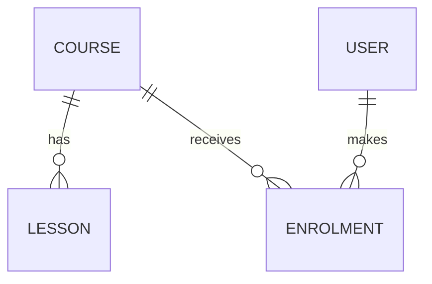

## Charts, mind maps and timelines

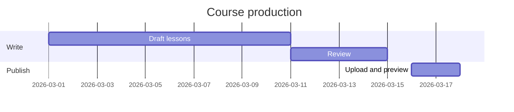

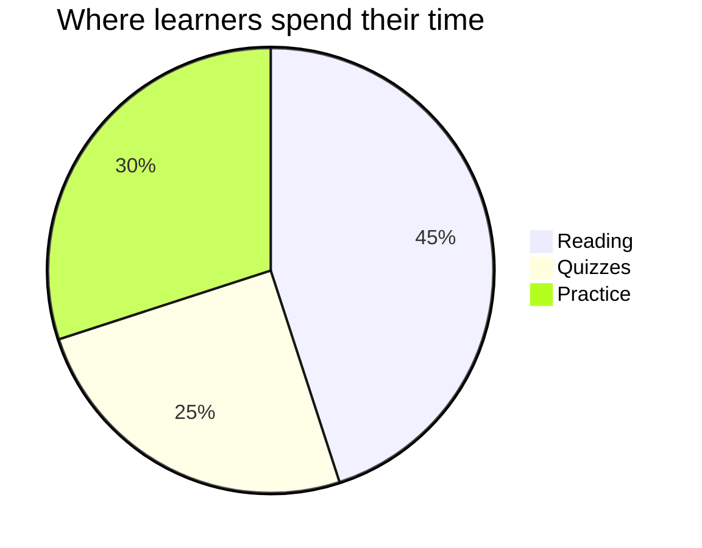

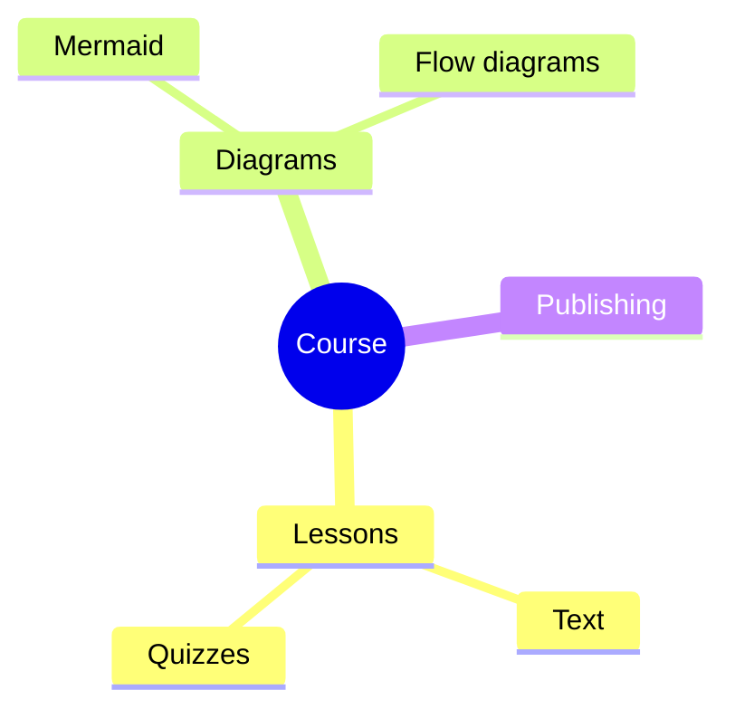

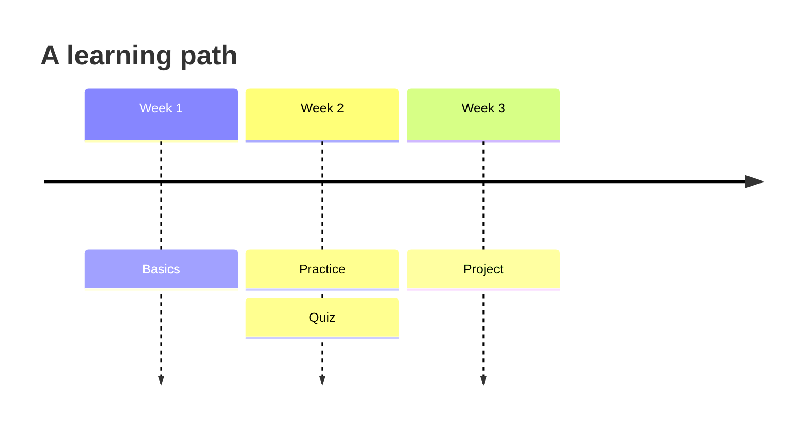

## When a diagram does not draw

The text is shown with a red outline. The usual causes:

| Problem | Fix |
| --- | --- |
| Brackets or quotes inside a label, such as `A[Pay (UPI)]` | Put the label in quotes: `A["Pay (UPI)"]` |
| The word `end` in lowercase inside a label | Write `End`, or put the label in quotes |
| A typo in the first line | The first line must be a diagram type from the table above |
| Wrong indentation in a `mindmap` or `timeline` | Indent children by two spaces under their parent |
| A link to a block that is not defined (in a class or ER diagram) | Define the block first, or check the spelling |

!!! warning "Uploads do not check Mermaid"
    The upload check reads quizzes, flow diagrams and formulas, but it cannot draw a Mermaid diagram. Always open the
    preview and look at every diagram before you publish.

## Good habits

- Put one sentence before a diagram saying what to notice, for example "The dashed box is the Kubernetes cluster". It
  helps everyone, and it is what a screen reader will rely on.
- Keep diagrams small enough to read. Split a big one into two.
- Prefer labels in plain words over codes.

```quiz
type: single
question: Which first line draws a database table diagram?
options:
  - classDiagram
  - erDiagram
  - flowchart TD
answer: 2
explain: erDiagram is for entity-relationship diagrams, the usual way to show database tables.
```

```quiz
type: multiple
question: Which of these will Learnatu's upload check catch for you?
options:
  - A quiz answer that points past the last option
  - A typo in a Mermaid diagram
  - A flow diagram that uses a block you never declared
  - A formula KaTeX cannot read
answer: [1, 3, 4]
explain: Mermaid diagrams are drawn in the browser, so they cannot be checked at upload. Preview them.
```
