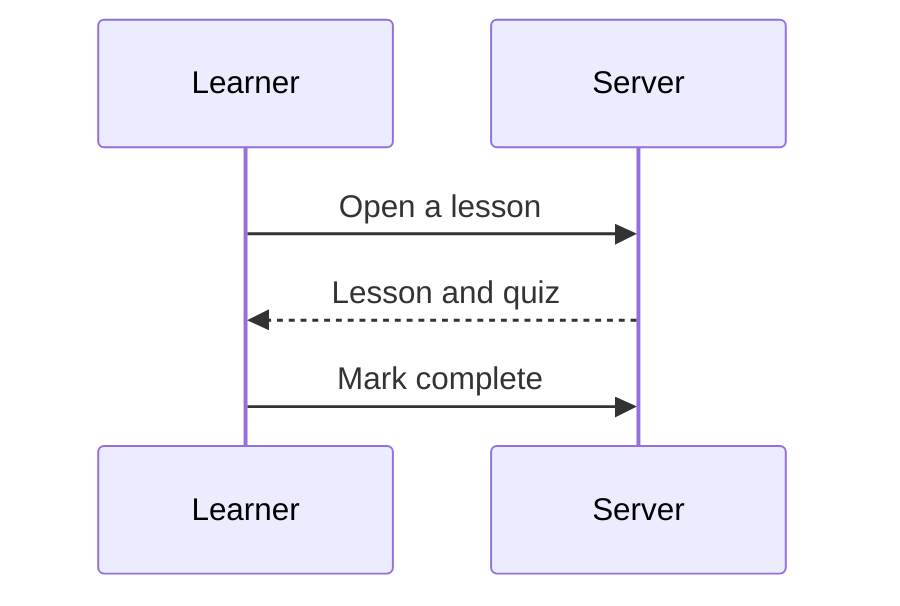
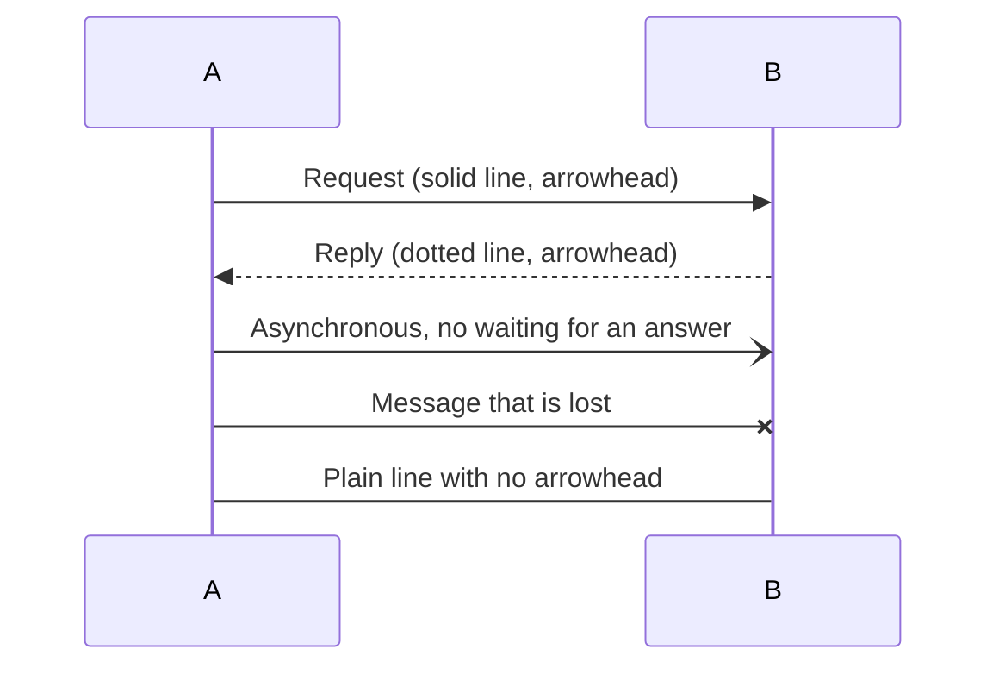
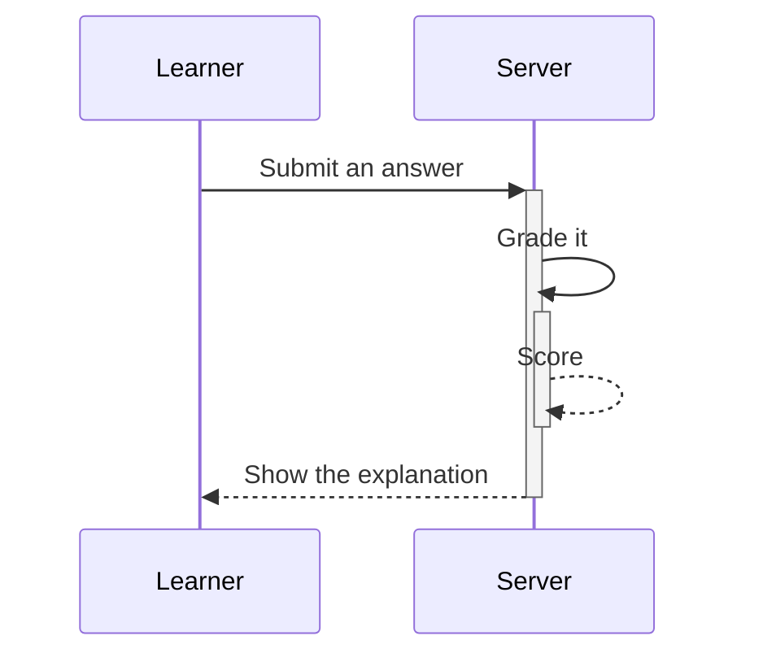
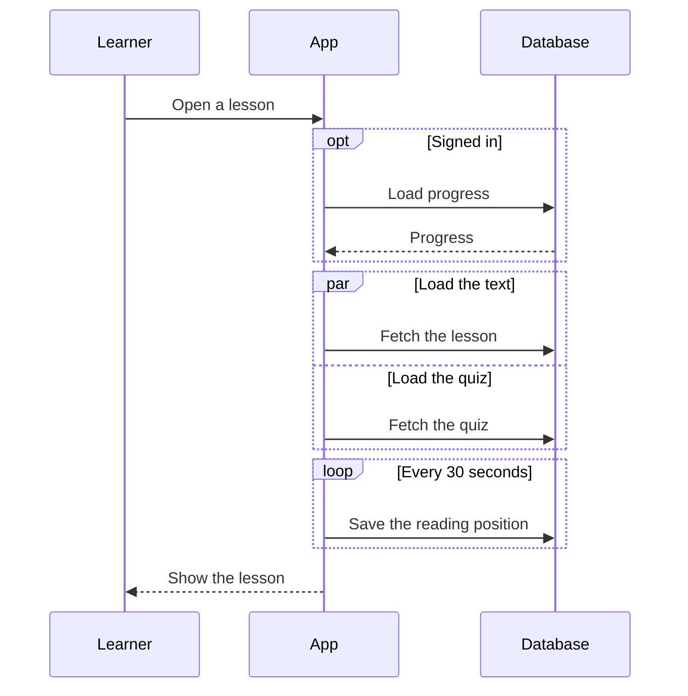
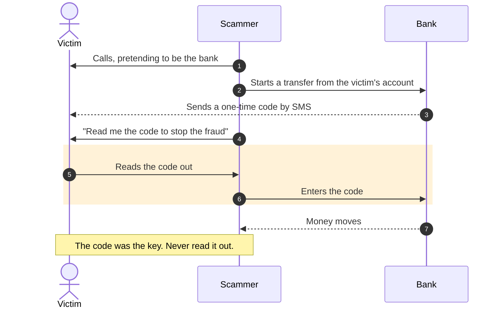

A **sequence diagram** shows a conversation: who sends a message to whom, in time order, top to bottom. It is the best
way to explain a process where several parties take turns, such as a payment, a sign-in or a scam call.

````markdown

````


## Participants

`participant L as Learner` creates a column named "Learner" that you can call `L` in the messages. Use `actor` instead of
`participant` to draw a person. Participants appear in the order you first mention or declare them.

## Arrows

The arrow tells the reader what kind of message it is:



## Activations

Show that someone is busy handling a request with `+` on the request and `-` on the reply:



## Choices, loops and parallel steps

| Block | Use it for |
| --- | --- |
| `alt` ... `else` ... `end` | Either/or: two or more branches |
| `opt` ... `end` | A step that only sometimes happens |
| `loop Text` ... `end` | Something repeated |
| `par` ... `and` ... `end` | Things that happen at the same time |
| `break Text` ... `end` | A step that stops the flow |



## Notes, numbering and highlights

`Note right of B: text`, `Note left of B: text` and `Note over A,B: text` add a note. `autonumber` numbers every
message. `rect` shades a group of steps; use a transparent colour so it works in light and dark themes.

A worked example that teaches something real, an OTP scam:



## Habits that make them clear

- Keep to about six participants. More than that, split the story.
- Write messages as actions ("Submit an answer"), not as technical names.
- Use `alt` for a real choice and leave the rest straight.
- Before the diagram, say in one sentence what to notice.

!!! warning "Check it in the preview"
    Mermaid diagrams are drawn in the browser, so the upload check cannot read them. If a diagram has a mistake, its
    text shows with a red outline. Preview every diagram before you publish.

```quiz
type: single
question: Which arrow draws a reply, with a dotted line and an arrowhead?
options:
  - ->>
  - -->>
  - -x
answer: 2
explain: A single dash is solid and a double dash is dotted. The second ">" gives the arrowhead.
```

```quiz
type: order
question: Put these parts of a sequence diagram in the order you would usually write them.
options:
  - sequenceDiagram
  - participant or actor lines
  - Messages
  - Notes and alt or loop blocks
explain: Start with the diagram type, name the participants, then write the conversation and add structure.
```
