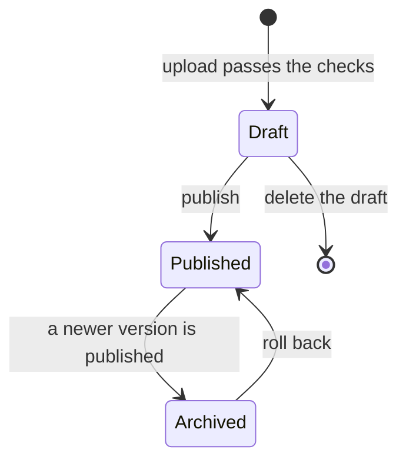

When your folder is ready, zip it and upload it. You need an author account for this.

## 1. Zip the folder

Zip the course folder itself, so that `course.md` is inside it. Either layout works:

````text
money-basics.zip
  money-basics/
    course.md
    en/...
````

````text
money-basics.zip
  course.md
  en/...
````

The course's name is the folder name (or the zip's file name). It must be lowercase words joined by hyphens, and it
cannot be a name that already belongs to a course in the website's own files.

## 2. Upload and read the report

Open **Author hub** and choose **Upload a course (zip)**. Pick the zip and press **Check and save as draft**.

- **Errors** stop the upload. Each names the file and the problem, for example a quiz answer that points past the
  last option, a lesson listed in `course.md` with no file, or a diagram with a mistake on line 4.
- **Warnings** do not stop it. For example, a lesson that has no Hindi version.

Fix what the report says and upload again.

## 3. Preview as a learner

A passing upload is saved as a numbered **draft**. Press **Preview**. You see the course exactly as learners will,
with a banner saying which version you are previewing. Click through the lessons, try the quizzes, and press play
on the diagrams. Choose **Exit preview** when you are done.

## 4. Publish, and roll back

Press **Publish** on the draft. It goes live for everyone at once, and the version it replaces is archived.
Changed your mind? **Roll back to this** on an older version publishes it again.



!!! warning "Keep lesson names the same"
    Learners' progress is saved by course and lesson name. If you rename or remove a lesson in a new version, the
    progress for it is lost. Add new lessons freely, but keep the names of existing ones.

```quiz
type: single
question: What do learners see after you upload a zip that passes the checks?
options:
  - The new version, straight away
  - Nothing yet. It is a draft until you publish
  - An email asking them to refresh
answer: 2
explain: Uploads are saved as drafts. Only you can preview them, and nothing changes for learners until you publish.
```
