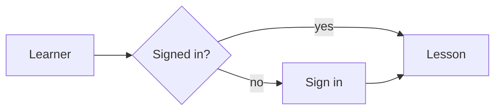
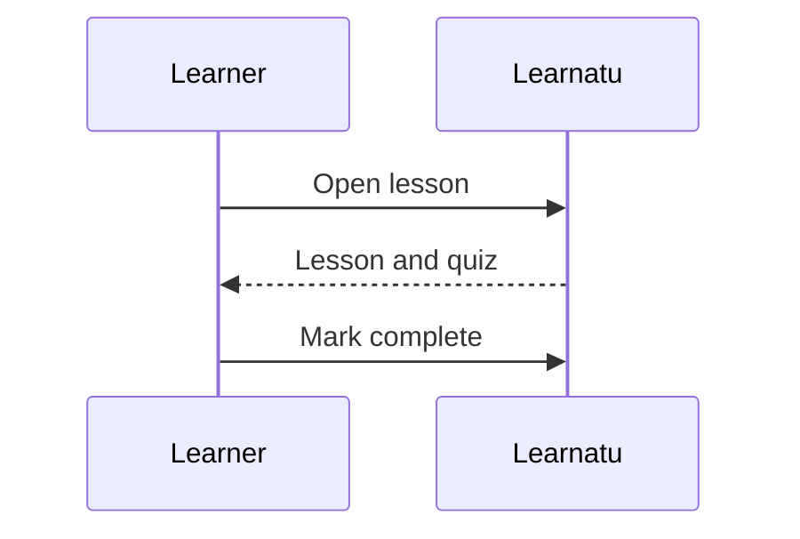

Fence a diagram with the word `mermaid`. It is drawn in the browser, follows the site theme, and stays
readable as text if drawing fails.

Any [Mermaid diagram type](https://mermaid.js.org/intro/) works: flowchart, sequence, class, state, ER, Gantt, mind map and more.
